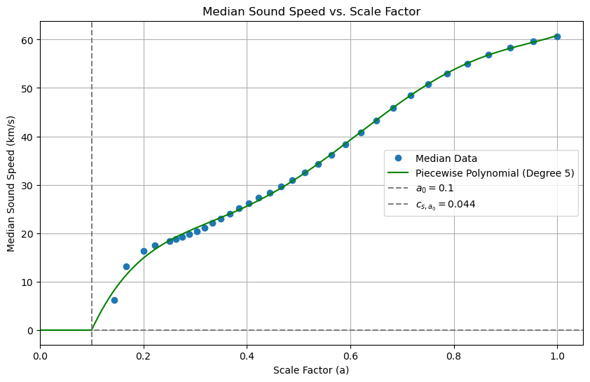

---
jupytext:
  text_representation:
    extension: .md
    format_name: myst
    format_version: 0.13
    jupytext_version: 1.14.1
kernelspec:
  display_name: Python 3
  language: python
  name: python3
---

# Tutorial & Visualisation

## Get the data

Import the module:

```{code-cell}
import H5CosmoKit as ckit
```

You can download e.g. snapshot_090 (z = 0.00) directly within this notebook.

```{code-cell}
urls = ["https://users.flatironinstitute.org/~camels/Sims/IllustrisTNG/CV/CV_0/snapshot_090.hdf5"] # extend the list as needed
local_files = ["snapshot_090.hdf5"]

for url, local_file in zip(urls, local_files):
    ckit.download_file(url, local_file)
```
## Density & Temperature

Now that we have the data, we can use the `H5CosmoKit` package to visualize density and temperature simple with `preview()`.

```{code-cell}
path = '.'  # Path to the snaps
snapshot_numbers = [90] # list of desired snapfile numbers

ckit.preview(path, snapshot_numbers, 'gas_density')
ckit.preview(path, snapshot_numbers, 'gas_temperature')
```

For interactive 3D visualization, you can use the `preview_3d()` function.

```
subset_size = 300000
ckit.preview_3d(path, snapshot_numbers, 'gas_density', subset_size)
```
<iframe src="_static/Snapshot_90_at_z=0.00_gas_density.html" width="700" height="400"></iframe>
- [View the 3D Density Plot](_static/Snapshot_90_at_z=0.00_gas_density.html)

```
subset_size = 150000
ckit.preview_3d(path, snapshot_numbers, 'gas_temperature', subset_size)
```
- [View the 3D Temperature Plot](_static/Snapshot_90_at_z=0.00_gas_temperature.html)

## Soundspeed & Internal Energy

You can visualize the distribution of sound speed or internal energy as a raincloud plot.

```python
ckit.plot_internalenergy_distribution(
    path='/gpfs/data/fs72085/mfo/CAMELS/CV0',
    snapshot_numbers=[32, 44, 60, 90],
    sample_size=50000
)
```


In addition to visualizing these distributions, you can also fit a polynomial to the median values of the sound speed or internal energy across multiple snapshots using the functions `plot_median_soundspeed_with_polynomial_fit()` and `plot_median_internalenergy_with_polynomial_fit()`.

```python
ckit.plot_median_internalenergy_with_polynomial_fit(path, snapshot_numbers)
```




## Power Spectra

As power spectra analysis uses Pylians, you might experience difficulties on machines other than Linux and Mac. For more details, visit the [Pylians documentation](https://pylians3.readthedocs.io/en/master/installation.html).

```{code-cell}
f_snap = './snapshot_090.hdf5'
ckit.power_ratio(f_snap)
```

## Phase diagrams

```{code-cell}
ckit.preview_phase_diagram(path, snapshot_numbers, quantity='temperature')
ckit.preview_phase_diagram(path, snapshot_numbers, quantity='pressure')
ckit.preview_phase_diagram(path, snapshot_numbers, quantity='entropy')
```
